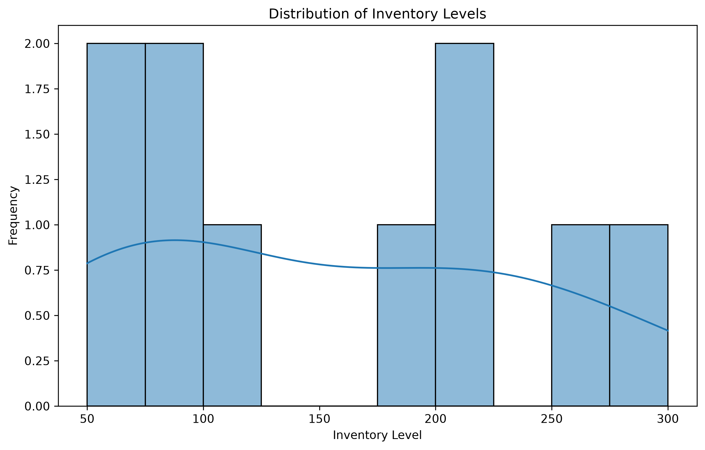
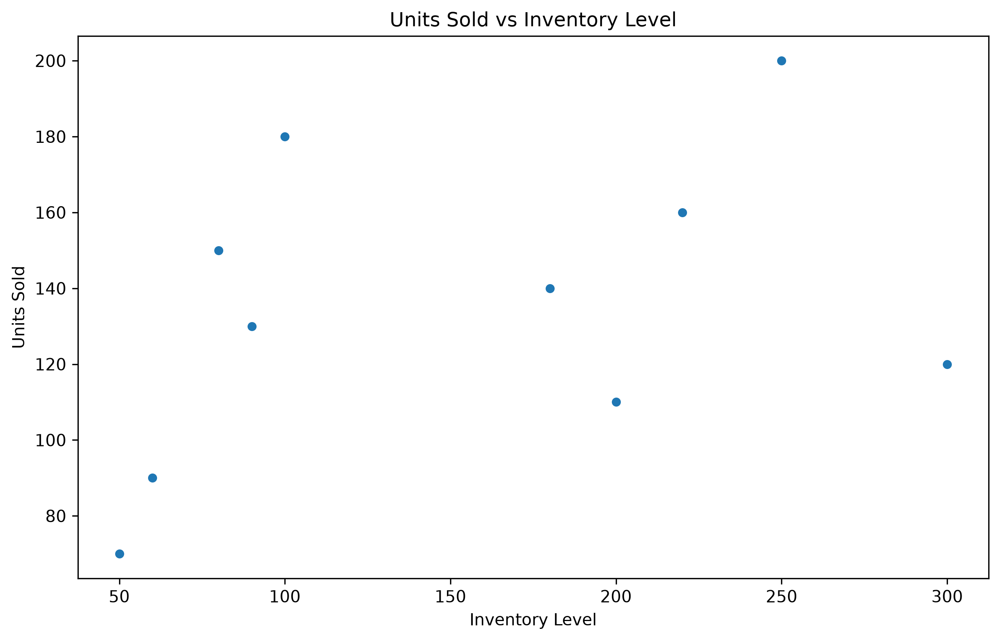
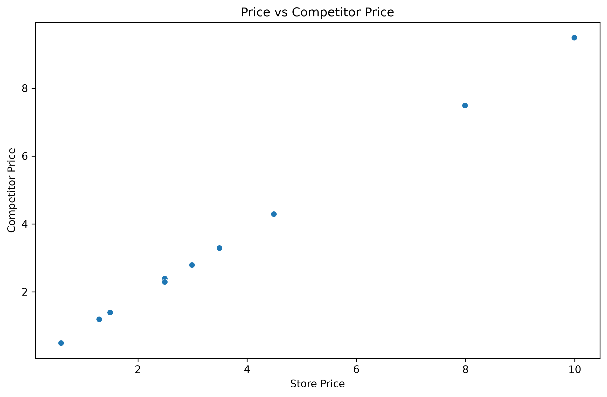
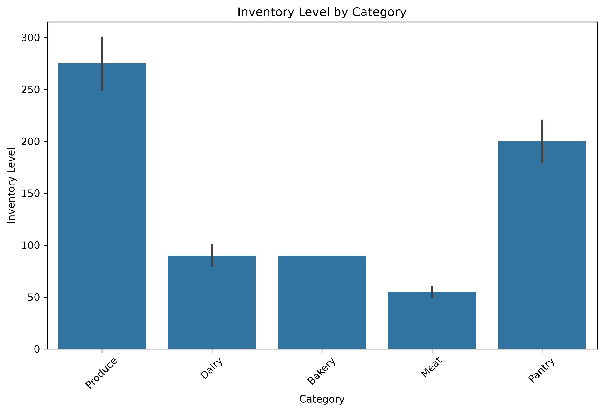
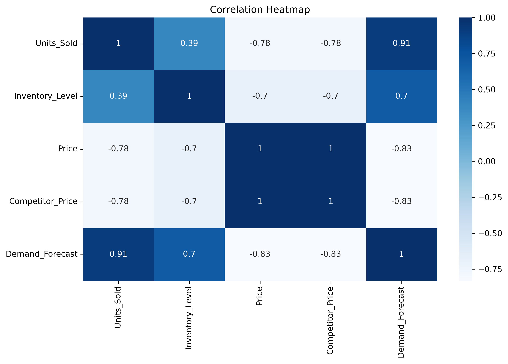

 **Download the Full Case Study (PDF)**  
[Evergreen Market Inventory Optimization Case Study](./Evergreen%20Market%20Inventory%20Optimization.pdf)
# Evergreen Market Inventory Analysis

##  Overview
Data analytics case study analyzing Evergreen Market’s retail dataset to improve inventory forecasting and operational efficiency.

##  Objectives
- Identify patterns in inventory levels and sales.
- Compare store prices vs competitor prices.
- Visualize category-level inventory distribution.
- Generate actionable insights for optimization.

##  Visualizations

##  Files
- `Evergreen_Market_Analysis.ipynb` — Jupyter notebook with full analysis.
- `retail_store_inventory.csv` — Dataset.
- `images/` — Saved graphs.
- `Evergreen Market Inventory Optimization.pdf` — Full case study report.

##  Download the Full Case Study
[Click here to view the PDF](Evergreen%20Market%20Inventory%20Optimization.pdf)

##  Tools Used
- Python (pandas, matplotlib, seaborn)
- Jupyter Notebook
- GitHub for version control

##  Key Insights
- Produce and Dairy categories show highest turnover.
- Inventory levels correlate strongly with demand forecasts.
- Competitive pricing drives higher sales volume.

##  Next Steps
- Automate forecasting using regression models.
- Expand analysis to multi-store data.
